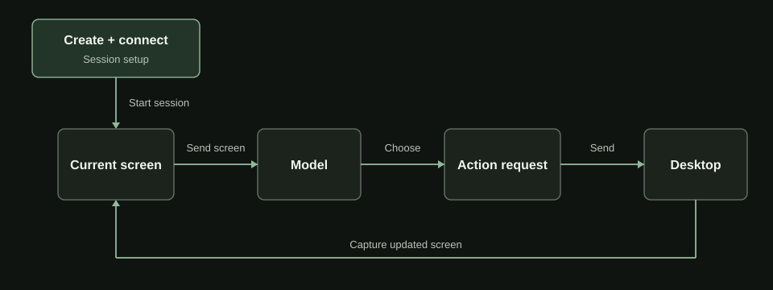
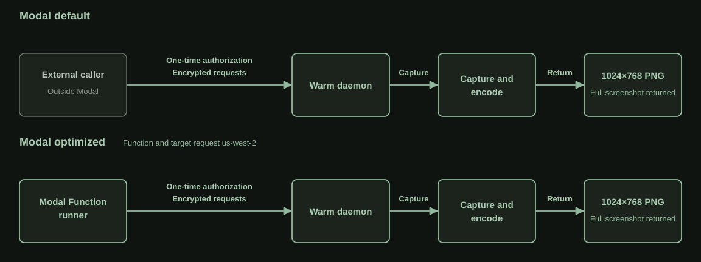
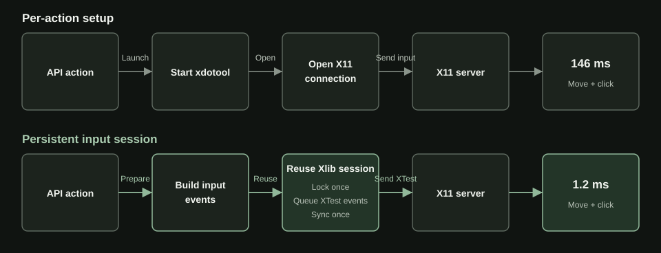
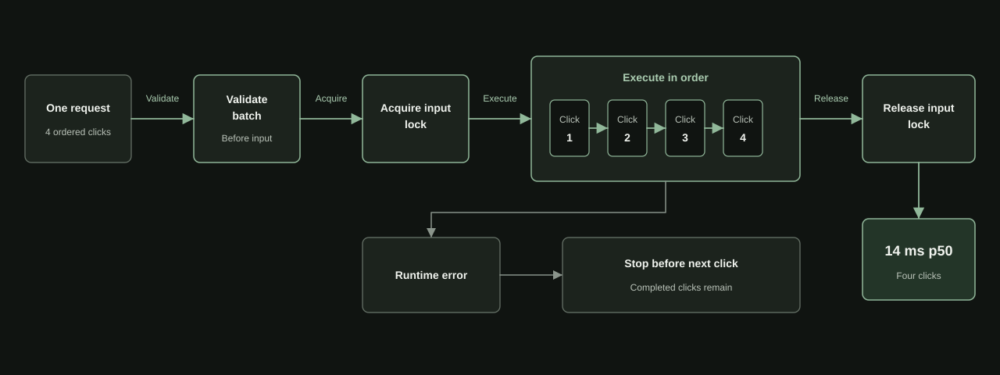
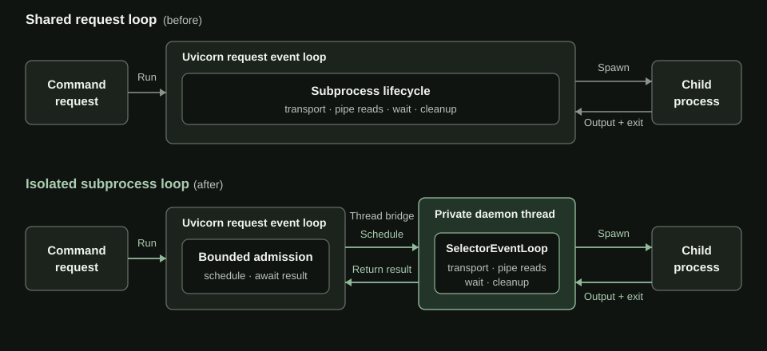
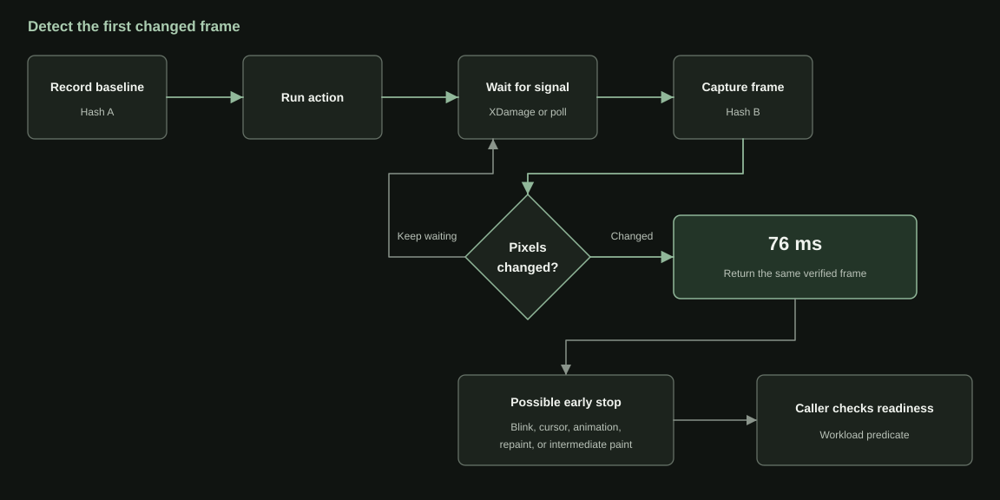

# How I got computer-use clicks to 10 ms on Modal

*The same warm path returns a full 1024x768 PNG in 29 ms.*

The first computer-use loop I built on Modal took about 550 ms to look at the screen and click once. The E2B and Daytona defaults took about 420 ms and 480 ms. I built the Modal path myself from lower-level primitives, which let me move the caller and rewrite the daemon as I traced it. Where did the half-second go?

A fifty-turn loop with one screenshot and one click pays the 550 ms delay fifty times. Averaged across the three baseline paths, that comes to roughly 24 seconds of waiting around the model. After the improvements, the optimized Modal path I built does the same fifty-turn loop in under 2 seconds.

[OpenAI says GPT-5.6 Sol on Cerebras can generate up to 750 tokens per second](https://openai.com/index/previewing-gpt-5-6-sol/). At that speed, hundreds of milliseconds in the computer interface no longer hide behind slow generation. Longer trajectories make the gap worse because the user pays it on every turn before getting the result.

RustDesk, an [open-source remote desktop system](https://rustdesk.com/docs/en/self-host/), taught me to separate connection setup from repeated traffic. It pays discovery and connection setup when a session begins, then reuses the live path for screen updates and input. Moving the mouse does not rediscover the remote computer. I started tracing one warm agent turn to find setup work that was still happening every time the agent looked at the screen or touched it.



E2B and Daytona expose ready-made computer-use primitives, and I benchmarked their documented defaults. Modal starts lower in the stack. Its Function and Sandbox primitives let me change the route to the desktop and rewrite the code touching X11 in the same Python-defined system. I wanted to see whether that control could beat the purpose-built defaults.

## Every screenshot made a round trip to my laptop

Each screenshot request crossed into Modal, reached the warm daemon inside the desktop Sandbox, and carried the PNG back over the same authenticated route. A full 1024x768 screenshot took 230 ms, on average. After the model chose a click, the action request made the trip again.

The desktop already ran on Modal. What if the screenshot client did too? I moved the same Python client from my laptop into a Modal Function, an autoscaled container for application code, and requested `us-west-2` for both the Function and target Sandbox. The caller now began in the same requested Modal region as the desktop.

I held the target and authenticated request path fixed and changed only the caller. One move-and-click fell from 32.4 ms with the laptop caller to 4.6 ms with the Function caller. In the final warm run, the full screenshot returned in 29 ms. Moving the caller inside Modal removed a trip to my laptop from every repeated desktop operation.

Modal treats a shared requested region as a scheduling policy. The Function and Sandbox can still land on different hosts or availability zones, and traffic continues through authenticated ingress.



Moving the caller adds Function compute while the trajectory runs. A `ComputerSessionHandle` lets that Function borrow the existing desktop and keep one authenticated client open without taking over the Sandbox lifecycle. The Function can scale to zero between invocations; the desktop remains billable while it is alive. I pay for transient Function time to remove the repeated laptop trip, then choose separately how long to keep the desktop warm.

## Why did every screenshot start a process?

With the request route shortened, I traced the work inside the screenshot handler. Every frame launched a command-line program, wrote a temporary PNG, reopened it, and returned its bytes. That is fine for a one-off utility. An agent takes a screenshot after nearly every action.

The RustDesk lesson applied one layer lower. The desktop and X11 display stayed alive, but every screenshot discarded its capture state and rebuilt the path to the pixels.

X11 is the display server that owns the desktop's pixels. MSS became the persistent capture client: the daemon opens it once at startup and reuses it. On Linux, XShm lets the X server write the frame into a shared-memory buffer. Each request can encode that frame as a PNG without starting a child process or touching the filesystem.

MSS still has two escape hatches. It cannot compose the X11 cursor, so cursor-visible screenshots use the file path. If its display connection fails, the daemon reopens it once, then falls back to file capture. The usual cursor-hidden frame stays in memory.

The usual cursor-hidden request now reads the current frame from the long-lived session and encodes it in memory. Process startup and temporary files stay out of the recurring path.

## A process for every click

On a local computer, a click feels instant. The desktop still receives separate input events. [macOS sends mouse events through Quartz](https://developer.apple.com/documentation/coregraphics/cgevent). My Sandbox runs a Linux desktop with X11, the window system that routes those events to applications. An agent's `click(x, y)` therefore has to become pointer motion, button press, and button release in X11's event stream.

My first implementation handed that translation to [`xdotool`](https://github.com/jordansissel/xdotool), the usual command-line tool for X11 automation. `xdotool` already knew how to speak to the display and synthesize input. Every API action launched a new invocation.

A pointer move followed by one click took about 146 ms inside the daemon. I checked what `xdotool` was doing beneath the CLI before replacing X11. It already used [XTest](https://www.x.org/releases/X11R7.6/doc/xextproto/xtest.html), the X11 extension for synthetic input, through Xlib.

A click at `(x, y)` needs three XTest events: move the pointer there, send button-down, then send button-up. `xdotool` wrapped those events in a complete program run. Before X11 saw the pointer move, Linux created a child process, loaded `xdotool` and its shared libraries, parsed the coordinates and button, and opened a display connection. After button-up, the process closed the connection and exited.

That boundary is convenient in a shell script. The script has no display connection to manage after the command returns, and a broken `xdotool` process does not crash its caller. When a person runs commands by hand, 146 ms is buried under the time spent typing and deciding what to do next. An agent issues the click as soon as the model chooses it, so the same setup adds directly to action latency and repeats on the next click.

I kept XTest and removed the per-action process. The daemon loads the X11 client libraries once, keeps one display connection open, and builds the motion, press, and release events in memory. Each request takes the input lock, queues the complete sequence, and synchronizes with the X server once at the end.



Inside the daemon, the mean for a pointer move followed by one left click fell from about 146 ms to 1.2 ms, a 128x speedup. Four move-and-click pairs took 4.8 ms instead of 444 ms, a near 100x speedup.

Typing sends at least a key-down and key-up for every character, plus modifiers when needed (on a US keyboard layout, `!` requires holding Shift while pressing `1`). The daemon-side mean for one hundred characters dropped from about 120 ms to 21 ms. One thousand dropped from 607 ms to 201 ms.

Keeping the connection open meant every request shared X11's keyboard and pointer state. Suppose two requests reach the daemon together. One sends `Ctrl+L` to focus the browser's address bar while the other starts typing a URL. If a `w` from the URL arrives before the first request releases Ctrl, the browser receives `Ctrl+W` and closes the tab. The daemon resolves each sequence against the active XKB layout and holds the input lock from the first press through the final release. A drag gets the same protection, so another request cannot move the pointer between mouse-down and mouse-up.

The failure boundary moved into the daemon with the connection. If XTest is unavailable before the first event, the daemon falls back to `xdotool`. Once a button press or key-down may have reached the X server, replaying the request could double-click or type a character twice. The daemon attempts to release anything it pressed and returns the error without fallback.

Xlib introduced another process-level risk. The daemon also uses it for window operations, and an application window can close between listing it and reading its attributes. Xlib's default asynchronous error handler treats that ordinary race as fatal and exits the process. I install a nonfatal handler before opening the display and check each operation's result, so a disappearing window fails one request instead of taking down the desktop API.

## Four clicks, one request

Making one local click take about a millisecond exposed the next repeated cost: asking for it over HTTP. The interfaces above my daemon could already express more than one action per turn. [OpenAI's computer tool](https://developers.openai.com/api/docs/guides/tools-computer-use) returns an ordered `actions[]` array. [Claude can return several `tool_use` blocks](https://platform.claude.com/docs/en/agents-and-tools/tool-use/parallel-tool-use) in one response, leaving the client to sequence operations that share state. [Browser Use](https://github.com/browser-use/browser-use/blob/main/browser_use/agent/service.py), an open-source agent framework, passes the model's action list to `multi_act`. Splitting those sequences into one request per click would throw away the batching before the actions reached the desktop.

The SDK keeps the model's sequence intact:

```python
computer.actions.run([
    {"type": "click", "x": 100, "y": 100},
    {"type": "click", "x": 300, "y": 100},
    {"type": "click", "x": 300, "y": 300},
    {"type": "click", "x": 100, "y": 300},
])
```

The daemon validates the batch before touching the desktop and holds the input lock while it executes each click in order. If click three fails, the response records clicks one and two and never sends click four. The same lock prevents another request from moving the pointer between a button press and release.



I sent the same four clicks both ways, 30 times each. One batch took 11.5 ms p50. Four sequential requests took 26.8 ms. Three extra trips through the request stack more than doubled the latency.

## Why did command p95 jump to 249 ms?

Once screenshots and clicks were taking tens of milliseconds, the command distribution looked wrong. The median was 56 ms, but p95 jumped to 249 ms even though the command already ran in a child process. Process separation had not moved the whole lifecycle away from the HTTP server. Uvicorn's event loop still managed the child's pipes, wait state, and cleanup, so a slow subprocess could hold up unrelated requests.

I moved the subprocess lifecycle onto a private `SelectorEventLoop` running on a daemon thread. A bounded queue caps outstanding work, and cancellation terminates the child's process group before releasing capacity. The HTTP loop only receives the result. Command latency fell to 9.9 ms p50 and 10.6 ms p95.



The clipboard exposed a stranger version of the same ownership bug. Agents use it to paste a command into a GUI terminal, put a long block into an editor, or fill a field without synthesizing hundreds of key events. Under X11, no central buffer stores clipboard text. A client process owns a selection, and X11 asks that process for the data when another application pastes. This is why `xclip` leaves a small process alive after a write: if the process exits, the clipboard contents disappear. In my daemon, that necessary background process accidentally kept the HTTP request open too.

My generic subprocess helper assumed that child output mattered. It created pipes for stdout and stderr, then `communicate()` waited until every process holding the write ends had closed them. The long-lived `xclip` owner inherited those handles. Suppose the agent copied a shell command and immediately tried to paste it into a terminal. The selection was ready, but the copy request remained stuck because `xclip` was still alive and still held the pipes open.

`xclip` had nothing to send back through stdout or stderr. I routed both streams to `DEVNULL` instead of creating pipes. The HTTP request could now finish as soon as `xclip` owned the selection, while the background process remained available for the eventual paste.

## Modal optimized was up to 650x faster than the tested default paths

A full screenshot returned in 29 ms, and one click took 10 ms.

I got up to 650x faster on the 1,000-character typing task. The benchmark sent a synthetic 1,000-character string to the active desktop. My Modal path sent every character through the persistent XTest connection and finished in 63 ms. Through E2B's computer-use SDK, the same task took about 41,000 ms, or 41 seconds.

| Warm operation | Modal optimized p50 / p95 | Modal default in this library p50 / p95 / ratio | Daytona default p50 / p95 / ratio | E2B default p50 / p95 / ratio | Tzafon default p50 / p95 / ratio |
| --- | ---: | ---: | ---: | ---: | ---: |
| Full screenshot, provider-native format | 28.69 / 43.96 ms | 229.94 / 235.78 ms / 8.02x | 264.85 / 297.67 ms / 9.23x | 212.75 / 225.28 ms / 7.42x | 146.14 / 168.34 ms / 5.09x |
| One click on the screen | 9.69 / 15.55 ms | 323.81 / 331.35 ms / 33.43x | 216.04 / 221.02 ms / 22.31x | 210.56 / 214.88 ms / 21.74x | 125.75 / 127.92 ms / 12.98x |
| Four ordered clicks | 13.64 / 21.98 ms | 342.68 / 349.16 ms / 25.12x | 865.55 / 1,061.66 ms / 63.45x | 855.81 / 876.02 ms / 62.74x | 455.96 / 531.37 ms / 33.42x |
| Type 100 characters | 15.27 / 20.69 ms | 379.28 / 389.18 ms / 24.84x | 638.50 / 706.86 ms / 41.81x | 4,090.74 / 4,194.92 ms / 267.86x | 82.27 / 85.45 ms / 5.39x |
| Type 1,000 characters | 63.34 / 83.91 ms | 378.40 / 413.17 ms / 5.97x | 5,356.25 / 5,425.81 ms / 84.57x | 41,048.75 / 41,619.86 ms / 648.12x | 181.03 / 212.66 ms / 2.86x |
| Non-login shell command | 9.54 / 17.03 ms | 182.43 / 346.47 ms / 19.12x | 116.92 / 120.86 ms / 12.26x | 52.18 / 54.35 ms / 5.47x | 29.60 / 30.84 ms / 3.10x |

I ran each provider through its public default computer-use path and tuned only Modal optimized. The Modal default is the public `ComputerSandbox` configuration in this library at the same revision; it already included MSS screenshot capture. Daytona, E2B, and Tzafon stayed on their defaults. The screenshot row uses each path's native format: Tzafon returned a 1280x720 JPEG, while Modal, Daytona, and E2B returned a 1024x768 PNG.

The four-click row shows what batching bought. Modal optimized, Modal default, and Tzafon accepted one four-click batch. Daytona required four requests, and four E2B SDK calls produced eight transport requests. In the two Modal rows, adding three clicks cost about 4 ms and 19 ms. Daytona and E2B each added about 650 ms. The repeated request work had become more expensive than the mouse input.

## What counts as the next frame?

A 10 ms click does not mean the application has painted its result. Suppose an agent clicks **Save** and immediately asks for another screenshot. The input endpoint can return successfully before the application paints its confirmation. The next frame may still show the old form, inviting the model to click again.

My first detector polled the screen. It waited for a configured interval, captured a frame, compared it with the baseline, and repeated until something changed. Polling works, but every miss pays for another capture.

XDamage is an X11 extension that reports when an area of the display has been repainted. I arm a watcher before the click and use the notification as a cue to capture. If XDamage is unavailable, the detector falls back to polling.

A repaint can draw the same pixels again, so the notification alone cannot prove that the screen changed. After each wake-up, the daemon captures the raw full-resolution RGB frame and hashes the bytes for every pixel. It compares that digest with the baseline before resizing or PNG encoding. A matching hash sends the detector back to sleep. A different hash gets encoded and returned as the next screenshot. XDamage saves work by preventing blind captures. The full-frame hash is the correctness check. Click to first changed frame took 65 ms p50 and 76 ms p95 across 30 samples.



A first changed frame answers one narrow question: has the action produced new pixels yet? That can replace a fixed sleep when the agent only needs the first visual response. It cannot tell whether **Save** has finished. A blinking cursor or intermediate paint may satisfy the pixel check first, and a successful operation can leave the watched region unchanged. Before a dependent action, the caller still needs an application-specific condition such as a saved confirmation.

## Startup still takes 7.8 seconds

Creating a fresh Modal desktop and receiving its first validated screenshot still took 7.8 seconds. That timer covers Sandbox allocation, desktop startup, daemon readiness, and the first frame. I have not split the result by stage, so another provider's template startup does not tell me which part of my path to change.

The next run needs timestamps at each boundary. If allocation dominates, I can test a pool of ready desktops. If desktop or daemon startup dominates, I can remove work from the image. Choosing before that trace would be a guess.

Once clicks reached a millisecond, stale frames mattered more than input latency. A fast click followed by an old screenshot can send the agent backward. Waiting for the first changed frame removes the blind sleep, but the agent still has to recognize when the application is ready. Making that readiness check fast is the next part of the loop.

## Source notes

- Current warm measurements: [Modal optimized samples, 2026-07-28](../../benchmark-data/modal-optimized-provider-2026-07-28.json), [provider-default samples, 2026-07-28](../../benchmark-data/provider-compare-coordinate-command-2026-07-28.json), [changed-frame samples, 2026-07-28](../../benchmark-data/modal-observation-2026-07-28.json), [four-click batching A/B, 2026-07-29](../../benchmark-data/modal-action-batching-ab-2026-07-29.json), and [Connect versus attested-tunnel A/B, 2026-07-29](../../benchmark-data/modal-optimized-ingress-ab-2026-07-29.json). The warm table predates ingress standardization and uses Connect; the subsequent controlled A/B found no clear ingress winner. The 50-turn opener is arithmetic over separate warm p50s, not a full agent trajectory.
- Historical diagnostics: [provider benchmark results, 2026-07-26](../benchmark-results-2026-07-26-provider-results.md), [combined sanitized result](../../benchmark-data/provider-results-2026-07-26.json), [Connect caller-placement evidence](../../benchmark-data/modal-optimized-competitive-us-west-2-2026-07-24.json), [native X11 input benchmark](../archive/benchmarks/benchmark-results-2026-07-23-native-x11-input.md), and [command runner A/B context](../../benchmark-data/tzafon-coordinate-command-context-2026-07-24.json). The Modal-default screenshot diagnostic separately summarized 22.83 ms p50 for daemon capture and encoding, 126.86 ms end to end, and a 103.91 ms remainder. Those summaries used different samples, so I do not add the component medians or label the remainder as network time. The historical command benchmark asked for `sh -lc`; the current comparison gives every provider the same logical `sh -c` command and requires exit zero with exact stdout `"42\n"`.
- Implementation and contracts: [performance documentation](../performance.md), [benchmarking methodology](../benchmarking.md), [visual-change observation contract](../experimental-visual-change-observation.md), and [create-to-validated-screenshot method](../../research/modal-optimized-create-benchmark-method.md).
- Product surfaces: [E2B Computer use](https://e2b.dev/docs/use-cases/computer-use) and [Daytona Computer Use](https://www.daytona.io/docs/en/computer-use/).
- Modal mechanics and cost: [Functions and Apps](https://modal.com/docs/guide/apps), [region selection](https://modal.com/docs/guide/region-selection), [Sandbox Connect](https://modal.com/docs/guide/sandbox-networking#connecting-to-sandboxes-with-http-and-websockets), [encrypted tunnels](https://modal.com/docs/guide/tunnels), [input concurrency](https://modal.com/docs/guide/concurrent-inputs), [Function scaling](https://modal.com/docs/guide/scale), [Sandbox resources](https://modal.com/docs/guide/sandbox-resources), [current list pricing](https://modal.com/pricing), and the tracked [provider and cost research memo](../../research/modal-computer-use-provider-cost-comparison-2026-07-29.md). The warm artifact did not include reconciled billing data, so the article describes the cost shape without assigning it a dollar estimate.
- External mechanisms: [OpenAI's GPT-5.6 Sol preview](https://openai.com/index/previewing-gpt-5-6-sol/), [OpenAI Computer use](https://developers.openai.com/api/docs/guides/tools-computer-use), [Anthropic parallel tool use](https://platform.claude.com/docs/en/agents-and-tools/tool-use/parallel-tool-use), [Browser Use's multi-action implementation](https://github.com/browser-use/browser-use/blob/main/browser_use/agent/service.py), [RustDesk self-hosting](https://rustdesk.com/docs/en/self-host/), [`xdotool`'s XTest/Xlib implementation](https://github.com/jordansissel/xdotool), [MSS shared-memory capture](https://python-mss.readthedocs.io/latest/release-history/v10.2.0.html), [X11 selection ownership](https://www.x.org/releases/X11R7.6/doc/libX11/specs/libX11/libX11.html), and Modal's [sandbox architecture account](https://modal.com/blog/scaling-to-1-million-concurrent-sandboxes-in-seconds).
