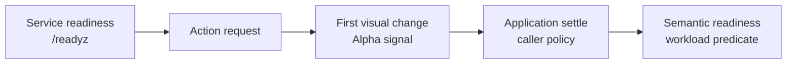

# Observe the first visual change after an action

> **Feature phase:** Alpha<br>
> **SDK interface:** Experimental<br>
> **Use for:** Evaluation and controlled agent loops<br>
> **Compatibility:** Method names, parameters, defaults, and result types can change.

Use this feature to issue an action batch once and receive the first correlated frame that differs
from the pre-action baseline. The signal can reduce unnecessary fixed delays when the first visual
response is useful. It does not tell you when the application is ready for the next interaction.
The primary SDK trajectory does not enable this feature by default.



`/readyz` reports that the daemon and desktop can accept work. This feature reports only the first
visual change after an action. Your application or agent loop must decide when the application is
settled and ready for the next step.

## Understand the contract

For each call, the feature:

- Issues the requested action batch once.
- Correlates the observation with the action request.
- Preserves action success or failure metadata.
- Returns the same captured frame that the detector used to confirm the change. The route derives
  the requested format, quality, and scale from that capture.
- Distinguishes a detected change from an unchanged frame or timeout.
- Reports a timeout when pixel verification completes after the change deadline. The returned
  frame and source hash still describe that completed capture.
- Applies the change deadline through pixel capture and hash verification. Image encoding occurs
  after this decision. Encoding time remains part of the end-to-end request latency.
- Uses full-resolution source pixels for verification. Requested format, quality, and scale do not
  change the detection result. If native raw pixels are unavailable, the daemon verifies a
  full-resolution lossless PNG capture and derives the response from that capture.
- Measures `ActionObservationResult.elapsed_ms` from immediately before the action-observe request
  is sent until the correlated frame is received.
- Preserves explicit `wait` actions and caller-supplied timing.
- Limits observation work with `change_timeout_ms`. Capture and pixel verification must finish by
  the deadline to report a detected change. Response encoding can finish after the deadline.
- Limits an ordinary capture or Xlib error to the current request. The daemon can accept a later
  request. Do not repeat the action automatically because it may have run before observation
  failed.

The feature does not confirm:

- Animation completion.
- DOM, network, or application idle.
- Visual stability after the first changed frame.
- Page settle or target enablement.
- Task success.
- Safety of the next action.
- That this signal is better than an explicit or fixed wait for every workload.

A timeout does not mean that the action failed. No detected change does not mean that the action had
no semantic effect.

## Use the experimental SDK method

```python
with computer.observation_stream(fps=0.01) as observations:
    result = observations._experimental_act_until_visual_change(
        actions=[{"type": "click", "x": 100, "y": 100}],
        change_timeout_ms=150,
    )

if result.action_result and not result.action_result.get("ok"):
    handle_action_failure(result.action_result)
elif result.change_detected:
    pixels = result.require_valid_frame(require_change=True)
    evaluate_application_condition(pixels)
elif result.change_timeout_reached:
    evaluate_timeout_frame(result.frame)
else:
    evaluate_unchanged_frame(result.frame)
```

Use `_experimental_act_until_visual_change()` for new evaluation code. `act_and_observe()` remains a
compatibility name with the same behavior. Neither method removes or shortens explicit `wait`
actions in the batch.

## Interpret the result

| Outcome | Meaning | What to do next |
| --- | --- | --- |
| Changed | The correlated frame differs from the pre-action baseline. | Check the application-specific condition before a dependent action. |
| Unchanged | The selected region and policy detected no difference. | Treat the frame as evidence, not proof that the action had no effect. |
| Timeout | The change deadline expired and the method returned a correlated frame. | Inspect the action metadata and frame. Do not treat the timeout as action failure. |
| Action failure | `action_result` reports that the batch failed. | Handle the action failure separately from the visual-change outcome. |

The metadata keeps the three visual outcomes distinct:

- Changed: `change_detected=true` and `change_timeout_reached=false`.
- Unchanged before the deadline: `change_detected=false` and `change_timeout_reached=false`.
- Timeout: `change_detected=false` and `change_timeout_reached=true`.

Use `require_valid_frame(require_change=True)` to validate a changed frame for measurement. It
checks correlation, action success, change and timeout metadata, geometry, format, and frame
reconstruction. It does not check whether the application is ready.

## Choose a synchronization method

Use the narrowest condition that matches the workload:

1. Use an application-specific predicate or assertion when one is available.
2. Preserve explicit waits requested by the model or caller.
3. Use first visual change when you have measured its false-positive and false-negative behavior
   for the workload.
4. Use an immediate screenshot or action-only path when you are measuring primitive latency rather
   than loop correctness.

The caller or model loop owns synchronization policy. Provider adapters normalize and execute
actions. They do not decide when an application is settled.

## Account for known limitations

- A cursor blink, caret, hover effect, clock, spinner, video, or unrelated repaint can cause a false
  positive.
- A semantic state change can occur without detectable pixels in the selected region.
- The first paint can occur before the application reaches its usable final state.
- Regional detection can miss an effect outside the selected region.
- XDamage is a wake-up hint, not semantic proof. Captured pixels and hashes determine whether a
  change occurred. If an XDamage event has no changed pixels, the daemon waits again until the
  change deadline. With `change_signal="auto"`, the daemon uses pixel polling when XDamage is
  unavailable. It also uses the remaining polling path when an XDamage-assisted observation is
  inconclusive.
- A cursor-visible request includes the rendered cursor in the verified returned frame. Cursor
  motion can therefore cause a detected change. Cursor-visible requests use pixel polling because
  cursor-only movement does not reliably produce an XDamage event.
- A timeout can return a valid correlated frame without proving action failure.
- Keyboard and desktop-wide actions usually need a broader observation region than pointer-local
  actions.

## Benchmark the signal

`action_to_first_changed_frame_ms` starts immediately before the correlated action-observe request
is sent. It ends when the correlated changed frame is received. The metric measures the first
detected visual response, not application settle or task completion.

Count a latency sample only when `action_result.ok` is true, the captured pixels differ from the
selected baseline, and pixel verification completes by the change deadline. Record failed actions,
unchanged frames, and timeout trials as failures or exclusions. Do not replace those trials.

| Measurement | Starts | Ends | Use it to measure |
| --- | --- | --- | --- |
| Action-only | Action request | Action acknowledgement | Primitive actuation latency |
| Immediate action-to-frame | Action request | First requested screenshot received | Screenshot-loop latency without change proof |
| Action-to-first-changed-frame | Action request | Correlated changed frame received | Latency to the first detected visual response |
| Semantic readiness | Action request | Workload-specific predicate passes | Readiness for a particular next step |

Steady-state model-loop latency also includes model, provider, tool, and caller-policy time. A
cross-provider action-only table does not measure this feature unless each provider uses the same
observation contract.

Historical benchmark case IDs and values keep their original names for artifact compatibility.
Interpret their action-to-frame values using the definitions above. See
[Performance](performance.md) for methodology, attribution fields, case identifiers, and historical
results.

## Tune the detector

The stream and observe-change protocol provides controls for timeout, polling, signal, region,
producer, confirmation, fallback, and frame encoding. Treat these controls as workload-specific
diagnostics, not universal recommendations.

See [Performance](performance.md) for defaults and attribution details. See
[Configuration](configuration.md) for action timing controls.

## Promotion criteria

Before promoting the feature, collect evidence that shows:

- Stable terminology and return shapes in at least two real agent-loop integrations.
- False-positive and false-negative behavior across representative applications.
- Comparisons of fixed waits, immediate screenshots, first visual change, and application-specific
  readiness policies.
- Timeout behavior that users interpret correctly.
- No changes to caller-controlled explicit waits.
- Reproducible results from at least two ingress or caller placements.
- Whether the method should return the first change, a quiet window, a predicate-confirmed frame,
  or a lower-level composable result.

When you provide feedback, include the application predicate used after the first changed frame,
the cause of any false signal, how timeout was handled, and which return shape made synchronization
easiest.
