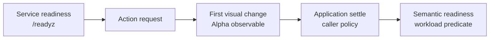

# Post-Action Visual-Change Observation

> **Feature phase:** Alpha  
> **SDK interface:** Experimental  
> **Intended use:** Evaluation and controlled agent loops  
> **Compatibility:** Method names, parameters, defaults, and result types may change.

This Alpha feature issues an action batch once and returns the first correlated frame produced after
the daemon detects a visual difference from the pre-action baseline. It can replace some blind fixed
sleeps when first visual response is a useful heuristic, but it does not establish that an
application is settled or ready for the next interaction.



`/readyz` reports whether the daemon and desktop substrate can accept work. The Alpha composition
reports only the first detected visual change after an action baseline. Application settle and the
semantic condition required for a next step remain caller-owned.

## What it guarantees

For one call, the implementation and its regression tests guarantee that:

- the requested action batch is issued once;
- the observation is correlated to that action request;
- action success or failure metadata is preserved;
- the returned frame is reconstructable and declares its geometry and format;
- metadata distinguishes detected change from unchanged or timeout outcomes;
- `ActionObservationResult.elapsed_ms` starts immediately before the action-observe send and ends
  when the correlated frame is received; and
- explicit `wait` actions and caller-supplied timing remain in the action contract.

## What it does not guarantee

A detected pixel or frame change is not proof of animation completion, DOM or network idle, target
enablement, page settle, task success, or safety of the next action. The composition does not
guarantee visual stability after the first changed frame or universal superiority to fixed and
explicit waits. A timeout does not mean the action failed, and no detected change does not mean the
action had no semantic effect.

## Experimental SDK example

```python
with computer.observation_stream(fps=0.01) as observations:
    result = observations._experimental_act_until_visual_change(
        actions=[{"type": "click", "x": 100, "y": 100}],
        change_timeout_ms=150,
    )

if result.action_result and not result.action_result.get("ok"):
    handle_action_failure(result.action_result)
elif result.change_detected:
    pixels = result.require_valid_frame(require_change=True)
    evaluate_application_condition(pixels)
elif result.change_timeout_reached:
    evaluate_timeout_frame(result.frame)
else:
    evaluate_unchanged_frame(result.frame)
```

`ObservationClient.act_and_observe(...)` remains as a behavior-preserving compatibility name. It
is not a promoted stable contract. Neither name suppresses, removes, or shortens explicit `wait`
actions in the supplied batch.

## Interpreting results

| Outcome | Meaning | Caller response |
| --- | --- | --- |
| Changed | The correlated frame differs from the pre-action baseline. | Evaluate the application-specific condition before the next dependent action. |
| Unchanged | No difference was detected under the selected region and policy. | Treat the frame as valid evidence, not proof that the action had no effect. |
| Timeout | The change deadline was reached and a correlated frame was returned. | Inspect action metadata and the frame; timeout alone is not action failure. |
| Action failure | `action_result` reports that the batch failed. | Handle the action failure independently of visual-change metadata. |

`require_valid_frame(require_change=True)` is a strict validation helper for changed-frame
measurements. It checks correlation, action success, change metadata, timeout state, geometry,
format, and frame reconstruction. It does not add a semantic readiness assertion.

## Synchronization decision ladder

1. Prefer a workload-specific predicate or application assertion when one is available.
2. Preserve explicit waits supplied by the model or caller.
3. Use first-visual-change observation when its heuristic matches the workload and false positives
   or false negatives are acceptable and measured.
4. Use immediate screenshots or action-only paths when measuring primitive latency rather than loop
   correctness.

Synchronization policy belongs to the caller or model loop. Provider adapters normalize and execute
actions; they do not choose settle policy.

## Known failure modes

- Cursor blink, caret, hover, clock, spinner, video, or an unrelated repaint can create a false
  positive visual change.
- A semantic state change may produce no detectable pixels in the selected region.
- The first paint can precede the usable final state.
- Regional detection can miss an effect outside the observed region.
- XDamage is a wake-up hint, not semantic proof; captured pixels and hashes remain the change gate.
- A timeout can return a valid correlated frame without proving action failure.
- Desktop-global and keyboard actions generally require broader observation than pointer-local
  actions.

## Benchmark semantics

`action_to_first_changed_frame_ms` starts immediately before the correlated action-observe request
is sent and ends when its correlated changed frame is received. It measures first detected visual
response, not application settle or semantic task completion.

| Measurement | Starts | Ends | What it supports |
| --- | --- | --- | --- |
| Action-only | Action request | Action acknowledgement | Primitive actuation latency |
| Immediate action-to-frame | Action request | First requested screenshot received | Screenshot-loop latency without change proof |
| Action-to-first-changed-frame | Action request | Correlated changed frame received | Latency to first detected visual response |
| Semantic readiness | Action request | Workload-specific predicate passes | Readiness for a particular next step |

Steady-state model-loop latency additionally includes model, provider, tool, and caller policy time.
Cross-provider action-only tables do not measure the Alpha composition unless every provider is run
through the same observation contract. Historical benchmark case IDs and recorded values retain
their original names for artifact compatibility; interpret their action-to-frame values using the
definitions above. See [performance.md](performance.md) for methodology, attribution fields, raw
case identifiers, and historical evidence.

## Advanced tuning

The stream and observe-change protocol exposes change timeout, polling, signal, region, producer,
confirmation, fallback, and frame-encoding controls. These are diagnostic and workload-specific
knobs, not universal recommendations. Defaults and detailed attribution behavior are documented in
[performance.md](performance.md); configuration-level action timing is documented in
[configuration.md](configuration.md).

## Alpha promotion criteria

Promotion requires evidence beyond an Alpha badge:

- stable terminology and return shape across at least two real loop integrations;
- documented false-positive and false-negative behavior across representative applications;
- comparisons of fixed wait, immediate screenshot, first change, and application-specific
  readiness policies;
- timeout semantics users interpret correctly;
- no violation of caller-controlled explicit waits;
- reproducible benchmarks from at least two ingress or caller placements; and
- a clear decision on whether the interface should return first change, a quiet window, a
  predicate-confirmed frame, or a composable lower-level result.

Useful feedback includes: which application predicate followed the first changed frame, what caused
false signals, whether timeout handling was understood, and which return shape made the caller's
settle policy simplest.
